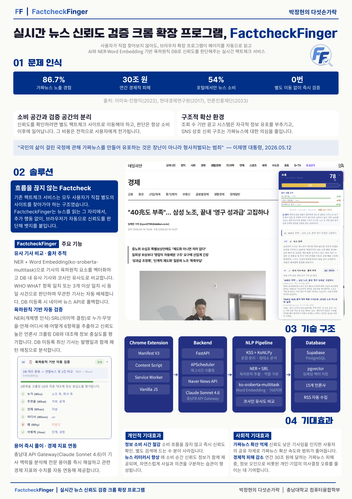
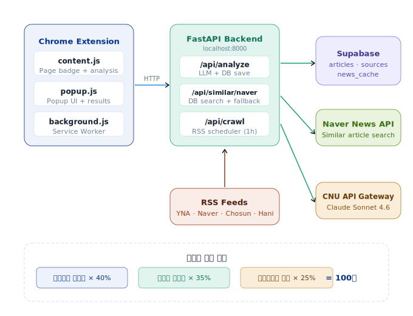

# FF | Factcheck-Finger

뉴스 신뢰도 자동 검증 브라우저 확장 프로그램

<br>

## 서비스 소개

**Factcheck-Finger(FF)** 는 뉴스 기사를 읽는 순간 별도의 검색 없이 브라우저 위에서 신뢰도를 즉시 검증하는 크롬 확장 프로그램입니다. 

허위 정보와 낚시성 기사가 범람하는 미디어 환경에서, 확장 프로그램으로 따로 검색 없이 바로 알 수 있게 하고, 서비스 운영 자원을 최소화하는 것을 핵심 목표로 합니다. 

LLM은 요약 및 논리 검증에만 사용하고, 데이터 가공 및 조회에는 NER, SRL, Word Embedding 기반 기술을 사용합니다.



<br>

## 핵심 기능

| 번호 | 기능 | 설명 |
|------|------|------|
| 01 | 육하원칙 기반 자동 검증 | 6항목을 크롤링 DB와 자동 대조해 기사의 정보 충실도를 평가합니다. 미등록 최신 기사는 발행일과 함께 패턴 매칭으로 분석합니다. |
| 02 | 클릭베이트 감지 | 제목-본문 키워드 일치율과 자극적 표현 패턴을 분석해 낚시성 기사를 탐지합니다. |
| 03 | 유사 기사 비교 · 출처 추적 | NER + Word Embedding 기반으로 RSS 크롤링 DB에서 동일 사건 기사를 탐색하고 신뢰도를 측정합니다. |
| 04 | 용어 즉시 풀이 · 경제 지표 연동 | AI 기반 전문 용어 자동 해설 및 기사 내 경제 지표 맥락 분석을 제공합니다. |

<br>

## 신뢰도 점수 산출 방식
 
신뢰도 점수는 DB 매칭 여부에 따라 두 가지 케이스로 나뉩니다.
 
**케이스 1 — DB 매칭 (신뢰도 높은 언론사 기사와 일치)**
 
```
신뢰도 점수 = DB 일치율 × 50% + 키워드 매칭률 × 30% + 클릭베이트 방어 × 20%
```
 
여러 신뢰도 높은 언론사에서 동일 내용이 확인될수록 가중치가 높아집니다.
 
**케이스 2 — DB 미매칭 (최신 기사 또는 미등록 기사)**
 
```
신뢰도 점수 = 키워드 매칭률 × 50% + 클릭베이트 방어 × 50% (최대 70점 상한)
```
 
DB에 등록되지 않은 기사는 내용의 사실 여부를 확인할 방법이 없으므로 최대 점수를 제한하고 추가 확인을 권장하는 코멘트를 함께 표시합니다.
 
**발행일 기반 경고**
 
| 발행일 | 표시 |
|--------|------|
| 7일 이내 | 표시 없음 |
| 7~30일 | 1개월 이내 기사입니다. |
| 30~180일 | 6개월 이전 기사입니다. 내용이 변경되었을 수 있습니다. |
| 180일 초과 | 오래된 기사입니다. 현재 상황과 다를 수 있습니다. |
 
<br>

## 기술 아키텍처



<br>

## NLP 파이프라인
 
LLM 없이 NER + SRL + Word Embedding으로 육하원칙을 추출하고 비교합니다.
 
**1단계 — 크롤링 시 (사전 처리)**
```
RSS 피드 수집 → 문장 분리(KSS) → 형태소 분석(KoNLPy)
→ NER + SRL로 육하원칙 추출 → Word Embedding 생성 → Supabase 저장
```
 
**2단계 — 조회 시 (실시간)**
```
사용자 기사 → 동일 처리 → WHO + WHAT 일치 또는 3개 이상 항목 일치 필터링
→ 나머지 항목 불일치로 신뢰도 측정
```
 
**무관한 기사 배제 알고리즘**
 
WHO(행위자) + WHAT 두 항목이 모두 일치하거나, 전체 6항목 중 3개 이상이 유사도 임계값(0.65) 이상일 때만 동일 사건으로 판단합니다. 그 미만이면 다른 사건으로 보고 비교에서 배제합니다.
 
**단어 다양성 처리 (Word Embedding)**
 
기자마다 같은 사건을 다른 단어로 표현하는 문제를 `jhgan/ko-sroberta-multitask` 모델 기반 문장 임베딩으로 해결합니다. "상승", "급등", "오름세" 같이 의미가 유사한 단어도 같은 개념으로 인식합니다.
 
**SRL 기반 주어/목적어 역할 구분**
 
"김동희가 박정현의 뺨을 때렸다"와 "박정현이 김동희의 뺨을 맞았다"처럼 등장인물은 같지만 역할이 다른 경우를 조사 패턴 분석으로 구분합니다.
 
**항목별 가중치**
 
| 항목 | 가중치 | 이유 |
|------|--------|------|
| 누가 (행위자) | 25% | 가장 중요, NER로 정확하게 추출 |
| 누가 (피행위자) | 15% | 역할 구분 필수 |
| 무엇을 | 25% | 사건의 핵심 |
| 언제 | 15% | 날짜 패턴으로 정확 |
| 어디서 | 12% | 중간 |
| 왜 | 5% | 없어도 감점 적음 |
| 어떻게 | 3% | 없어도 감점 적음 |
 
<br>

## 기술 스택

### Chrome Extension

| 기술 | 용도 |
|------|------|
| Manifest V3 | 크롬 확장 최신 표준 |
| Content Script | 페이지 내 배지 삽입 및 본문 추출 |
| Service Worker | 백엔드 API 통신 중계 |
| Vanilla JS | 팝업 UI 및 아코디언 인터랙션 |

### Backend

| 기술 | 용도 |
|------|------|
| FastAPI (Python) | REST API 서버 |
| Supabase (PostgreSQL + pgvector) | 기사 분석 이력 및 뉴스 캐시 DB, 벡터 유사도 검색 |
| APScheduler | 매 1시간 RSS 자동 크롤링 |
| feedparser | 주요 언론사 RSS 피드 파싱 |
| KSS | 한국어 문장 분리 |
| KoNLPy (Okt) | 형태소 분석, 조사/어미 제거 |
| sentence-transformers | 한국어 문장 임베딩 생성 |
| PyTorch + Transformers | NER/SRL 모델 구동 |
| Claude Sonnet 4.6 (충남대 API Gateway) | 뉴스 요약, 용어 풀이, 경제 지표 분석 |
| Naver News API | 실시간 유사 기사 검색 폴백 |

<br>

## 프로젝트 구조

```
FF-Factcheck-Finger/
│
├── Chrome Extension
│   ├── manifest.json
│   ├── content.js          페이지 분석 + 배지 렌더링
│   ├── background.js       Service Worker, API 중계
│   ├── popup.html          팝업 UI
│   ├── popup.js            팝업 로직
│   ├── styles.css          배지 디자인 시스템
│   ├── icon48.png
│   └── icon128.png
│
└── backend/
    ├── main.py             FastAPI 엔드포인트 + RSS 크롤러
    ├── nlp/
    │   ├── extractor.py    NER + SRL 기반 육하원칙 추출
    │   ├── embedder.py     Word Embedding 생성 + 코사인 유사도
    │   └── matcher.py      DB 유사 기사 탐색 + 신뢰도 산출
    ├── requirements.txt
    ├── schema.sql          Supabase 테이블 정의
    ├── .env.example        환경변수 템플릿
    └── run.bat             Windows 서버 실행 스크립트
```

<br>

## API 엔드포인트
 
| 메서드 | 경로 | 설명 |
|--------|------|------|
| POST | /api/analyze | LLM 기사 분석 + DB 저장 |
| POST | /api/similar/naver | 유사 기사 검색 (DB + 네이버 폴백) |
| POST | /api/nlp_match | NER + 임베딩 기반 육하원칙 DB 대조 |
| POST | /api/db_match | DB 신뢰도 매칭 점수 산출 |
| POST | /api/verify5w | 육하원칙 DB 대조 검증 |
| POST | /api/crawl | RSS 수동 크롤링 트리거 |
| GET | /api/news/stats | 뉴스 캐시 현황 |
| GET | /api/history | 분석 이력 조회 |
| GET | /api/sources | 출처별 신뢰도 목록 |
| GET | /api/test | 연결 상태 테스트 |
 
<br>
## DB 스키마
 
### articles
 
| 컬럼 | 타입 | 설명 |
|------|------|------|
| id | UUID | PK |
| title | TEXT | 기사 제목 |
| url | TEXT | 기사 URL |
| domain | TEXT | 언론사 도메인 |
| trust_score | INTEGER | 신뢰도 점수 |
| grade | TEXT | 등급 |
| summary | TEXT | AI 요약 |
| terms | TEXT(JSON) | 전문 용어 풀이 |
| economic_indicators | TEXT(JSON) | 경제 지표 |
| fact_claims | TEXT(JSON) | 검증 필요 주장 |
| created_at | TIMESTAMPTZ | 분석 시각 |
 
### news_cache
 
| 컬럼 | 타입 | 설명 |
|------|------|------|
| url | TEXT | 기사 URL (UNIQUE) |
| title | TEXT | 기사 제목 |
| description | TEXT | 기사 요약 |
| source | TEXT | 언론사명 |
| confirmed_count | INTEGER | 여러 언론사 확인 횟수 |
| w5h_data | JSONB | 육하원칙 추출 결과 |
| embeddings | JSONB | 항목별 임베딩 벡터 |
| created_at | TIMESTAMPTZ | 수집 시각 |
 
<br>
## 수집 언론사
 
연합뉴스, 네이버 뉴스 (정치/경제/사회/IT), 조선일보, 한겨레, MBC, KBS
 
<br>
## 설치 및 실행
 
### Chrome 확장 설치
 
```
1. chrome://extensions 접속
2. 개발자 모드 ON
3. 압축해제된 확장 프로그램 로드
4. FF-Factcheck-Finger 폴더 선택
```
 
### 백엔드 서버 실행
 
```bash
cd backend
pip install -r requirements.txt
run.bat
```
 
### 환경변수 (.env)
 
```
SUPABASE_URL=https://your-project.supabase.co
SUPABASE_SECRET_KEY=sb_secret_...
ANTHROPIC_API_KEY=your-api-key
NAVER_CLIENT_ID=your-naver-client-id
NAVER_CLIENT_SECRET=your-naver-client-secret
```
 
<br>

## 보안 고려사항

- API 키는 `.env` 파일로만 관리, 코드에 하드코딩 금지
- `.env` 파일은 `.gitignore`에 반드시 추가
- Chrome Extension의 `host_permissions`으로 허용 도메인 제한
- Supabase RLS 설정으로 DB 접근 제어

<br>

© 2026 박정현의 다섯손가락 (충남대학교). All rights reserved.
